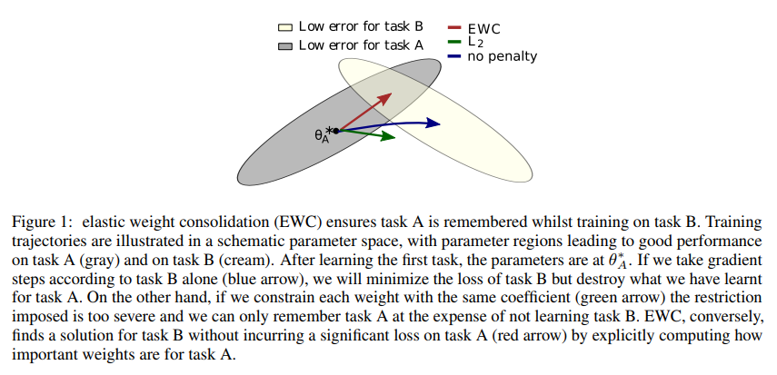
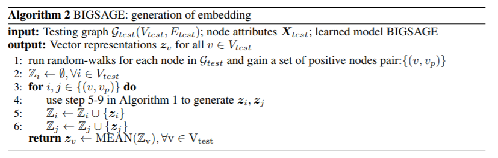
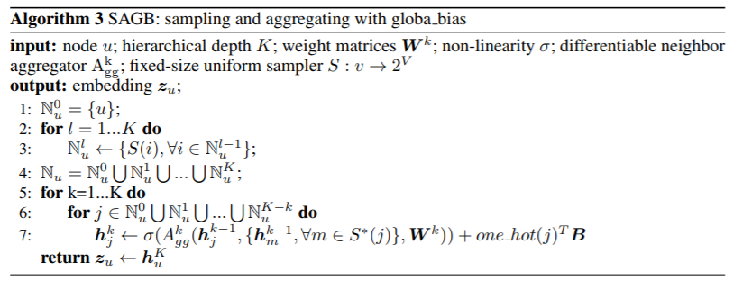

### Graph Inductive Embedding

##### Deep Gaussian Embedding of Graphs

introduce G2G model （Graph2Gauss）

##### Overcoming catastrophic forgetting in neural networks

Artificial general intelligence requires  that agents are able to learn and remember many different tasks. The term catastrophic forgetting occurs specifically when the network is trained sequentially on multiple tasks. In this paper, demonstrates a model EWC (elastic weight consolidation)  to the continual-learning problem. 

The key relies in the loss function:

$$
L(\theta)=L_B(\theta)+\sum_i\frac{\lambda}{2}F_i(\theta_i-\theta_{A,i}^*)^2
$$
$F_i$ is the Fisher information matrix F,$\theta_{A,i}^*$ means the $i^{th}$ parameter of task A

Algorithm EWC outperform in the supervised learning experiment, MNIST, reinforcement learning.

##### SPINE: Structural Identity Preserved Inductive Network Embedding

Those existing method for embedding are short of 

1.leveraging the global structural information between nodes distant from each other

2.learn embedding on one single fixed network.

##### problem define:

undirected network $G=\{V,E,F\}$, V denotes the set of nodes, E denotes the set of edges.

$F \in R^{|V|×f}$ The matrix A is the adjacent matrix. $A_{i,j}=\omega_{i,j}$ is the edge weight.

Transition matrix P:
$$
P_{i,j}=\frac{\omega_{i,j}}{\sum_{k=1}^{|V|}\omega_{i,k}}
$$
The goal is to learn a latent $E \in R^{|V|×d}$ ， d is the dimension of latent vector.

##### structural identity

Here we introduce a well-known high-order proximity of a network named RPR:
$$
S^{RPR}=\beta_{RPR}PS_i^{RPR}+(1-\beta_{RPR})g_i
$$
repeat m times, $\beta_{RPR} \in(0,1) $ is the probability of the current node randomly walking to a neighbor rather than jumping back to the start node. 

a complete structural properties as:
$$
T_i=[t_1(v_i),t_2(v_i),...,t_n(v_i)]
$$
$t(v_i)$   = for example, number of nodes at distance k of $v_i$ (k hop neighbors), = centrality of $v_i$

##### structural feature generation

select top k value of $S_i^{RPR}$ 

##### embedding generation

denote the content matrix of the corresponding k nodes as $F_i^k \in R^{k×f}$ 从F中选出k行组成$F_i ^k $
$$
e_i=\sigma(\sum_{j=1}^kT_{i,j}F_{i,j}^kW_M)
$$
$F_{i,j}^k \in R^f$ is the $j^{th}$ row of $F_i ^k$ ,$\sigma$ is the non-linear activation function

 

### BIGSAGE: unsupervised inductive representation learning of graph via bi-attention sampling and global-biased aggregating

BIGSAGE, given a network $G=\{V,E,X\}$ ,$X \in R^{|V|×f}$ is the attribute matrix of nodes.

$z$ is the final embedding vector.

loss function:
$$
J_G(z_v)=-log(\sigma(z^T_vz_{v_p} ))-Q·E_{{v_n}\sim P_n(v)}log(\sigma(-z^Tz_{v_n}))
$$
 $v_p$ indicates positive sample, $v_n$ indicates negative sample

$Z_1,Z_2$为空集，SAGB基于矩阵W以及attribute将节点v映射到embedding向量. 重复T次之后$Z_1,Z_2$ 中分别有T个embedding向量，使用BIATT模块计算Attention加权和

BIATT模块：

$h_m, h_n$ 分别代表positive组中的两节点
$$
h_{nt}^K=A_{gg}(h_n^{K-1},\{h_{j\in N^t(n)}^{K-1}\})
$$

$$
h_{mt}^K=A_{gg}(h_m^{K-1},\{h_{j\in N^t(m)}^{K-1}\})
$$

$t=1,...,T$

计算两两之间的相似度
$$
S_{i,j}=\alpha(h_{ni}^K,h_{mj}^K) ,i,j=1,...,T
$$
$\alpha$ is for dot-product operation.

sum by collumn:
$$
attn_n=reduce\_sum(softmax(S),0)
$$
sum by row:
$$
attn_m=reduce\_sum(softmax(S),1)
$$
final:
$$
h_n=\sum_{t=1}^Tattn_{nt}h_{nt}^K
$$

$$
h_m=\sum_{t=1}^Tattn_{mt}h_{mt}^K
$$

Global Bias

as a supplement to the aggregator
$$
h_i^{k+1}=W^{k+1}(h_i^k,\{h_{j \in N(i)}^k\})+b_{agg}^{k+1}+b_i
$$

$$
z_i=h_i^K
$$

