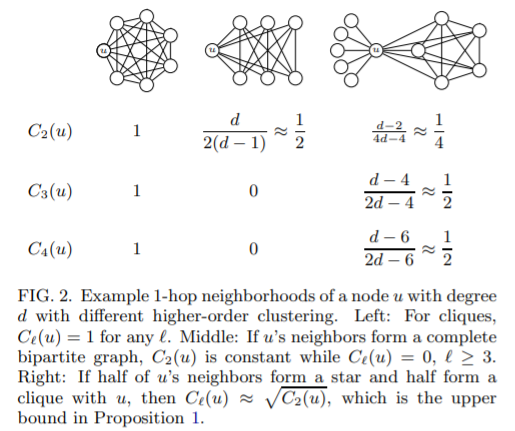

Clustering is a fundamental property of complex networks.

clustering coefficient of network is the probability that a length-2 path is closed.

但是clustering coefficient只与三角形有关，实际情况中经常遇到比三角形更复杂，（度数更高）形状

$$
C=\frac{6|K_3|}{|W|}
$$
$K_3$ is the set of triangles, W is the set of wedges

local clustering coefficient of a node:
$$
C(u)=\frac{2|K_3(u)|}{|W(u)|}
$$

$$
\overline{C}=\frac{1}{|\tilde{V}|}\sum_{u\in \tilde{V}}C(u)
$$

Generalizing to higher-order clustering coefficient
$$
C_l=\frac{(l^2+l)|K_{l+1}|}{|W_l|}
$$

$$
C_l(u)=\frac{l|K_{l+1}(u)|}{|W_l(u)|}
$$

$$
\overline{C_l}=\frac{1}{|\tilde{V_l}|}\sum_{u\in \tilde{V_l}}C_l(u)
$$

$$
|W_l(u)|=|K_l(u)|·（d_u-l+1）
$$

$$
C_l(u)=\frac{l·|K_{l+1}(u)|}{(d_u-l+1)·|K_l(u)|}
$$

Analysis:

1. External bounds

   for any $l\geq3$, $0\leq C_l(u)\leq \sqrt{C_2(u)}$

