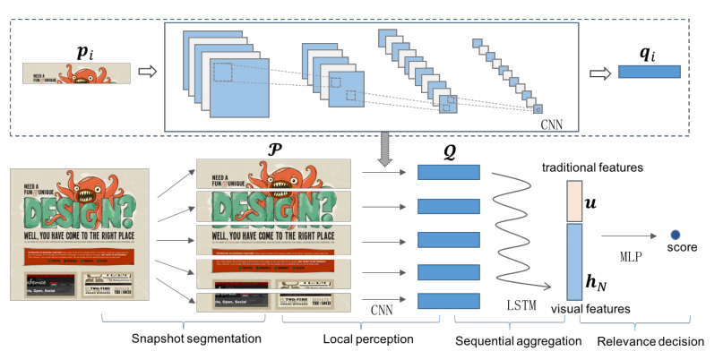

##### Learning Visual Features from Snapshots for Web Search

由于快照是一张图片，最简单的方法就是直接使用现有的CNN网络。本篇paper提出了基于CNN与LSTM的ViP模型。

##### Snapshot Segmentation Layer

A typical step for image processing. Snapshot Segmentation layer is to generate a set of horizontal region proposals. $P=\{p_1,p_2,...,p_n\}$

##### Local Perception Layer

CNN layer
$$
Z_{i,j}^{(1,k)}=\sigma(\sum_{s=0}^{r_k-1}\sum_{t=0}^{r_k-1}W_{s,t}^{(1,k)}·Z_{i+s,j+t}^{(0)}+b^{(1,k)})
$$

$$
W_{i,j}^{(2,k)}=max_{0\leq s\leq d_k} max_{0\leq t\leq d_k} Z_{i·d_k+s,j·d_k+t}^{(1,k)} 
$$

region proposal$p_i$ goes through local perception layer and get vector $q_i$

##### Sequential Aggregation Layer

LSTM layer

$Q={q_1,q_2,...,q_N}$
$$
i_t=\sigma(W_iq_t+U_ih_{t-1}+b_i)
$$

$$
f_t=\sigma(W_fq_t+U_fh_{t-1}+b_f)
$$

$$
c_t=f_tc_{t-1}+i_ttanh(W_cq_t+U_ch_{t-1}+b_c)
$$

$$
o_t=\sigma(W_oq_t+U_oh_{t-1}+b_o)
$$

$$
h_t=o_ttanh(c_t)
$$

$W_i,W_f,W_o,W_c,U_i,U_f,U_o,U_c,b_i,b_f,b_o,b_c$ are parameters to be learned, σ denotes the sigmoid function

The output of the LSTM layer is $h_N$

##### Relevance Decision Layer.

concate the output vector of LSTM layer $h_N$ and human feature $u$ as vecotr $v$
$$
score=W^1·\sigma(W^0·v+b^0)+b^1
$$
 

$W^0,W^1,b^0,b^1$ are parameters to be learned.

